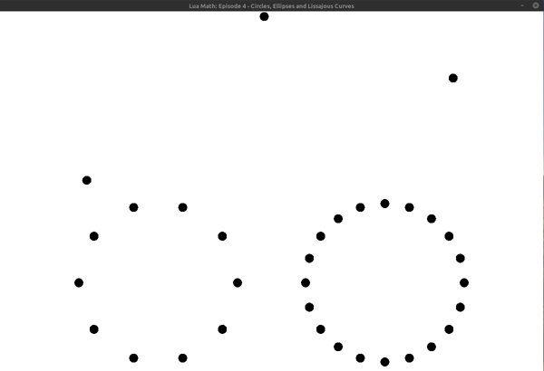

## Lua Math: Episode 4 - Circles, Ellipses and Lissajous Curves

Use sine and cosine functions to:
- animate an object along a circular path
- animate an object along an elliptical path
- animate an object along a lissajous curve
- draw *n* number of objects evenly spaced around a circle

**Challenge:** Draw *n* number of objects around an ellipse or lissajous curve by combining code from the animation examples with code form the evenly spaced objects example

