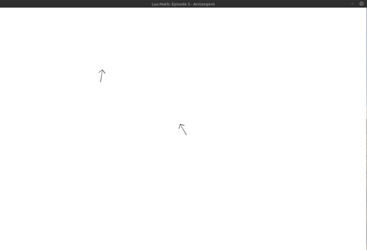

## Lua Math: Episode 5 - Arctangent

Use atan functions to:
- make an arrow always point toward the mouse cursor

**Challenge:** animate arrow to follow a circular path but still always point toward the mouse cursor

Note: I had to use `math.atan2(dy, dx)` even though it's deprecated in Lua 5.3 because `math.atan(dy, dx)` wasn't working the same as `math.atan2(dy, dx)` even though according to the [Lua 5.3 Reference Manual: 6.7 - Mathematical Functions](https://www.lua.org/manual/5.3/manual.html#6.7), it should.

`math.atan(dy/dx)` worked as expected (not properly discerning the correct quadrant when the mouse cursor was in negative x space, relative to the arrow)

