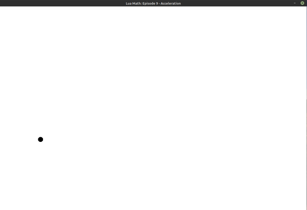
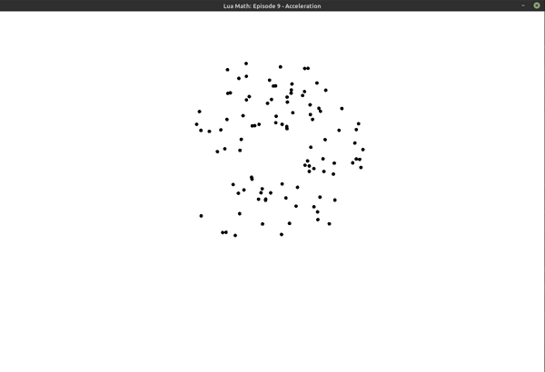

## Lua Math: Episode 9 - Acceleration

Add some acceleration to a couple animations from Episode 8

- cause a ball to arc across the screen from bottom left to bottom right, following an acceleration curve.
- add gravity to the 'fireworks' particle burst, giving it a more realistic appearance. (To run from within episode09 folder, type `love fireworks`)

